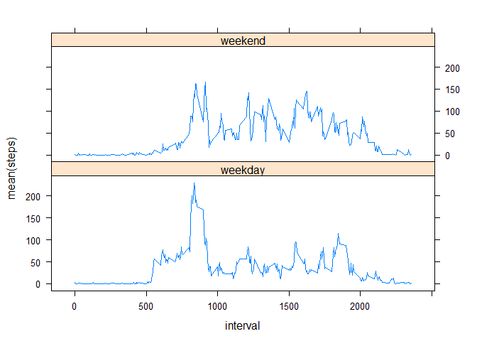

# Reproducible Research: Peer Assessment 1


## Loading and preprocessing the data

```r
suppressMessages(library(dplyr))
library(lattice)
library(chron)
original_csv <- read.csv(unz("activity.zip","activity.csv"))
original_csv$date <- as.Date(original_csv$date,"%Y-%m-%d")
clean_csv <- na.omit(original_csv)
```

## What is mean total number of steps taken per day?
The total number of steps taken per day is:

```r
total_per_day <- select(summarise_each(group_by(original_csv, date), funs(sum)),date,steps)
hist(total_per_day$steps, breaks = 20 ,main = "Histogram of total steps per day", xlab = "total steps per day")
```

 

The mean of the total number of steps taken per day:

```r
mean((total_per_day$steps), na.rm = TRUE)
```

```
## [1] 10766.19
```

The median of the total number of steps taken per day:

```r
median((total_per_day$steps), na.rm = TRUE)
```

```
## [1] 10765
```


## What is the average daily activity pattern?

plot of the 5-minute interval (x-axis) and the average number of steps taken, averaged across all days (y-axis):

```r
avg_steps_by_interval <- summarise(group_by(clean_csv, interval),mean(steps))
plot(avg_steps_by_interval,type='l',xaxt="n",xlab="5 minutes interval")
axis(1, at = seq(100, 2300, by = 100), las = 2)
```

 

The 5-minute interval, on average across all the days in the dataset, that contains the maximum number of steps:

```r
avg_steps_by_interval[order(avg_steps_by_interval$`mean(steps)`, decreasing = T),][1,]$interval
```

```
## [1] 835
```


## Imputing missing values

The total number of missing values in the dataset:

```r
sum(is.na(original_csv$steps))
```

```
## [1] 2304
```

Histogram of the total number of steps taken each day:

```r
filled_csv <- original_csv
mean_per_day <- summarise(group_by(clean_csv, date),mean(steps))
for(i in 1:nrow(filled_csv)){
    if(is.na(filled_csv[i,1])){
        if(length(mean_per_day[mean_per_day$date == filled_csv[i,2], 2][[1]]) == 1){
            rep_value <- mean_per_day[mean_per_day$date == filled_csv[i,2], 2][[1]]
        } else if(length(avg_steps_by_interval[avg_steps_by_interval$interval == filled_csv[i,3], 2][[1]]) == 1) {
            rep_value <- avg_steps_by_interval[avg_steps_by_interval$interval == filled_csv[i,3], 2][[1]]
        } else {
            rep_value <- 0
        }
        filled_csv[i,1] <- rep_value
    }  
}

total_per_day_filled <- select(summarise_each(group_by(filled_csv, date), funs(sum)),date,steps)
hist(total_per_day_filled$steps, breaks = 20, main = "Histogram of total steps per day with filled data", xlab = "total steps per day")
```

 

The new mean of the total number of steps taken per day:

```r
mean(total_per_day_filled$steps)
```

```
## [1] 10766.19
```

The new median of the total number of steps taken per day:

```r
median(total_per_day_filled$steps)
```

```
## [1] 10766.19
```

## Are there differences in activity patterns between weekdays and weekends?

Panel plot containing a time series plot of the 5-minute interval (x-axis) and the average number of steps taken, 
averaged across all weekday days or weekend days (y-axis):

```r
weekdays <- data.frame(weekday = character(nrow(filled_csv)))
levels(weekdays$weekday) <- c("weekday","weekend")
for(i in 1:nrow(weekdays)) {
    if(is.weekend(filled_csv$date[i])) {
        weekdays$weekday[i] <- "weekend"
    } else {
        weekdays$weekday[i] <- "weekday"
    }
}
csv_with_weekday <- cbind(filled_csv,weekdays)
grouped_by_iw <- summarise(group_by(csv_with_weekday, interval, weekday),mean(steps))
xyplot(`mean(steps)` ~ interval | weekday ,grouped_by_iw,layout = c(1,2),type = 'l')
```

 
